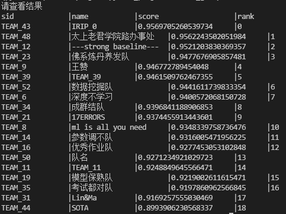

# ml2021_group

数据集可放在./dataset下，.gitignore已忽略该文件夹

## 关键修改写在下面

### 2021年12月24日

    mu: 创建项目，数据集类放在DatasetLib文件夹下，模型类放在ModelLib中，通用函数定义放在UtilLib中；
    trainValid.py在测试集上进行训练+验证；
    代码还跑不起来，可能有各种bug；

### 2021年12月25日

    mu: 修复bug，代码跑起来了
    创建两个分支尝试新模型       efficientNet: ./DatasetLib/automl-master/efficientnetv2/effnetv2_model.py
                    Tresnet: ./DatasetLib/ImageNet21K-main/src_files/models/tresnet/tresnet.py

### 2021年12月26日

    最好test acc：74.5%

### 2021年12月27日

    最好test acc: 94% efficientNet V2
    liangwei:TResnet、增加自动数据增强、增加批量提交代码，trainValid整理
    Tresnet失败

### 2022年12月31日

    最好test acc: 94.7%，ResNeSt269e
    7种模型投票后结果95.6%, rank 0.

## TODO

### 1

    引入其他汽车分类数据集做预训练，例如：CompCars Dataset

### 2

    ResNeSt上不同Loss的实验并没有尝试

### 3

    还可尝试更多的模型做集成

### 4

    可针对此问题设计更适合的损失函数
